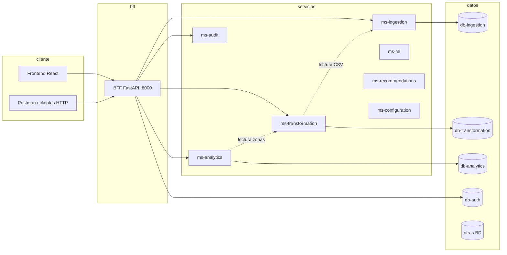

# Plataforma de analítica territorial — Documentación técnica

**Versión del documento:** 1.0  
**Ámbito:** código en este repositorio (BFF, microservicios, frontend).

---

## 1. Objetivo

Sistema distribuido para **cargar datos territoriales en CSV**, **validarlos**, **transformarlos** para análisis, exponer **indicadores y ranking**, y ofrecer una **API unificada** (BFF) y una **interfaz web** para usuarios autenticados.

---

## 2. Arquitectura general



- El **frontend** solo habla con el **BFF** (URL configurable con `REACT_APP_API_URL`).
- Los microservicios se comunican por HTTP dentro de la red Docker (`ms-*:8000` internamente).
- Cada dominio puede tener su **PostgreSQL** dedicado.

---

## 3. Stack tecnológico

| Capa | Tecnología |
|------|------------|
| Frontend | React (Create React App), React Router |
| API agregadora | Python 3.11, FastAPI, Uvicorn |
| Microservicios | FastAPI, SQLAlchemy async, PostgreSQL |
| Autenticación | JWT (Bearer), bcrypt |
| Datos CSV | Pandas (ingesta y transformación) |
| Contenedores | Docker Compose |

---

## 4. Servicios y puertos (host)

Orquestación definida en `Docker-compose.yaml` en la raíz del proyecto.

| Servicio | Puerto en el host | Rol |
|----------|-------------------|-----|
| **frontend** | 3000 | Interfaz web |
| **bff** | 8000 | API unificada, auth, proxy a microservicios |
| **ms-ingestion** | 8001 | Carga y validación de CSV; almacenamiento en `db-ingestion` |
| **ms-transformation** | 8002 | Transformación HU-07; datos en `db-transformation` |
| **ms-analytics** | 8003 | Indicadores y ranking (consume datos de transformación) |
| **ms-ml** | 8004 | Reservado (healthcheck; extensible) |
| **ms-recommendations** | 8005 | Reservado (healthcheck; extensible) |
| **ms-configuration** | 8006 | Reservado (healthcheck; extensible) |
| **ms-audit** | 8007 | Registro de eventos enviados desde el BFF |

**Bases de datos PostgreSQL** (puertos en host): 5432 ingesta, 15433 transformación, 5434–5439 según servicio (ver compose).

**Comando típico de arranque** (desde la raíz del repositorio):

```bash
docker compose up --build
```

Documentación interactiva OpenAPI:

- BFF: `http://localhost:8000/docs`
- Cada microservicio expone `/docs` en su puerto mapeado.

---

## 5. Historia de usuario HU-07 (Transformación)

### 5.1 Descripción

El sistema debe **transformar datos estructurados** ya cargados en ingesta para prepararlos al análisis, **sin modificar** el archivo ni los registros originales en **ms-ingestion**.

### 5.2 Implementación

| Elemento | Ubicación |
|----------|-----------|
| Endpoint de transformación | `POST /sync/zones` en **ms-transformation** |
| Cliente que descarga el CSV desde ingesta | `services/ms-transformation/app/services/ingestion_client.py` |
| Lógica Pandas, reglas, upsert | `services/ms-transformation/app/routers/sync.py` |
| Tablas | `transformation_runs`, `transformed_zone_data` en **db-transformation** |
| Disparo desde el BFF (JWT) | `POST /api/zones/sync` |
| Sincronización tras carga (opcional en segundo plano) | `bff/app/routers/load.py` |

### 5.3 Flujo resumido

1. Se obtiene el **último dataset** adecuado desde ingesta (prioridad `valid`, luego `partial`).
2. Se descarga el **CSV por HTTP** (solo lectura).
3. Se validan **columnas obligatorias**; si faltan, respuesta **400** con detalle.
4. Se normaliza y transforma con **Pandas** (densidad, índices, etc.).
5. Se registra un **`TransformationRun`** con metadatos de reglas.
6. Se hace **upsert** por `zone_code` en **`transformed_zone_data`**.

### 5.4 Criterios de aceptación (referencia)

- Procesar el último dataset cargado según la lógica de listado en ingesta.
- Persistir en `db-transformation`; no alterar datos en ingesta.
- Evitar duplicados lógicos por código de zona (upsert).
- Registrar trazabilidad en `transformation_runs`.
- Rechazar CSV sin columnas requeridas con mensaje claro.

---

## 6. API del BFF (referencia rápida)

Prefijo base: `http://localhost:8000` (ajustar si cambias el puerto).

| Método | Ruta | Autenticación | Descripción |
|--------|------|----------------|-------------|
| POST | `/api/auth/register` | No | Alta de usuario |
| POST | `/api/auth/token` | No | Login (form urlencoded OAuth2) |
| GET | `/api/auth/me` | Bearer | Perfil del usuario |
| POST | `/api/load/` | Bearer | Subida de CSV a ingesta |
| GET | `/api/datasets` | No | Lista de datasets (proxy ingesta) |
| GET | `/api/zones/` | No | Zonas transformadas (proxy) |
| POST | `/api/zones/sync` | Bearer | Ejecuta HU-07 (transformación) |
| GET | `/api/indicators` | Bearer | Indicadores (proxy analítica) |
| GET | `/api/ranking` | No | Ranking (proxy analítica) |
| GET | `/api/recommendations` | No | Recomendaciones derivadas del ranking |
| GET | `/health` | No | Salud del BFF y comprobación de microservicios |

---

## 7. Documentación en el código

Además de este documento, el repositorio incluye **docstrings y comentarios de módulo** en:

- `bff/app/` — routers, servicios, seguridad, modelos.
- `services/ms-ingestion/app/`, `services/ms-transformation/app/`, `services/ms-analytics/app/`, etc.
- `fronted/src/` — cabeceras JSDoc en servicios y componentes principales.

Para detalle por función o clase, consultar el código fuente o la documentación automática en `/docs` de cada servicio FastAPI.

---

## 8. Exportar este documento a PDF

- **VS Code / Cursor:** instalar extensión “Markdown PDF” o abrir la vista previa del `.md` e imprimir a PDF desde el navegador.
- **Pandoc** (si lo tienes instalado):

  ```bash
  pandoc docs/DOCUMENTACION_TECNICA.md -o DOCUMENTACION_TECNICA.pdf
  ```

---

*Documento generado para acompañar el código del proyecto; actualizar la versión si cambia la arquitectura o los contratos de API.*
